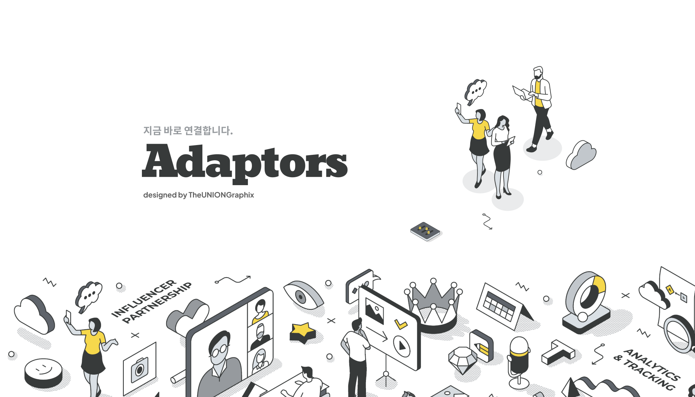

# 🔌 Adaptors

모두를 연결하라! Adoptors! <br>
취업/이직에 특화된 쉽고 편리한 멘토링 플랫폼. <br>
AI피드백, 화상•채팅 서비스, 간편한 멘토링 생성 기능 <br>
대용량 트래픽에 대한 분산처리가 가능한 MSA(Micro Service Architecture) 구조의 프로젝트입니다. <br><br>

### 특징

- EDA(Event Driven Design)를 적용, 카프카 이벤트 기반으로 느슨한 결합을 가집니다.
- 각 서비스들의 독립적 DB구조에서 효율적 집계를 담당하는 Batch-service.
- 카프카 소스/싱크 커넥트를 사용한 CDC 기반 데이터 동기화 처리.
- CQRS (Command and Query Responsibility Segregation) 적용. <br>
  쓰기와 읽기의 책임을 명확히 분리하였습니다.
- 헥사고날 아키텍처를 적용하여 기술 코드와 비즈니스 코드를 분리. <br>
  도메인로직에 집중 하여 기술적 요구사항에 빠르게 대응할 수 있도록 했습니다.

<hr>

- **개발 기간** : 2024.10.07 ~ 2024.12.15 (11주)
- **플랫폼** : Web
- **개발 인원** : 9명 <br><br>

<table align="center">
  <tbody align="center"> 
    <tr>
      <td align="center" valign="middle" width="100%">
        
      </td>
    </tr>
    <tr>
      <td align="center" valign="middle" colspan="2" width="50%">
        <table width="100%">
          <tr>
            <td align="center" valign="middle" width="50%">
              
            </td>
            <td align="center" valign="middle" width="50%">
              
            </td>
          </tr>
        </table>
      </td>
    </tr>
  </tbody>
</table> <br>

## 🔎 목차

<div align="center">

### <a href="#developers">🌟 팀원 구성</a>

### <a href="#techStack">🛠️ 기술 스택</a>

### <a href="#systemArchitecture">🌐 시스템 아키텍처</a>

### <a href="#skills">📲 기능 구성</a>

### <a href="#directories">📂 디렉터리 구조</a>

### <a href="#projectDeliverables">📦 프로젝트 산출물</a>

</div>
<br>

## 🌟 팀원 구성

<a name="developers"></a>
<div align="center">
<table align="center" width="100%" border="1">
  <tbody>
    <!-- 첫 번째 행 -->
    <tr>
      <td height="320px" align="center" colspan="2"> 
        <a href="">
           <br> 정훈석 <br>(Frontend)
        </a>
      </td>
      <td height="320px" align="center" colspan="2">
        <a href="">
           <br> 설찬우 <br>(Frontend)
        </a>
      </td>
      <td height="320px" align="center" colspan="2">
        <a href="">
           <br> 김예진 <br>(Frontend)
        </a>
      </td>
    </tr>
    <tr>
      <td height="320px" align="center">
        <a href="">
           <br> 김대희 <br>(Backend)
        </a>
      </td>
      <td height="320px" align="center">
        <a href="">
           <br> 김성태 <br>(Backend)
        </a>
      </td>
      <td height="320px" align="center">
        <a href="">
           <br> 강수빈 <br>(Backend)
        </a>
      </td>
      <td height="320px" align="center">
        <a href="">
           <br> 허정현 <br>(Backend)
        </a>
      </td>
      <td height="320px" align="center">
        <a href="">
           <br> 백승엽 <br>(Backend<br>&DevOps)
        </a>
      </td>
      <td height="320px" align="center">
        <a href="">
           <br> 오대관 <br>(DevOps)
        </a>
      </td>      
    </tr>
  </tbody>
</table>


<!-- <table>
    <tr>
        <td height="320px" align="center"> <a href="">
             <br>  정훈석 <br>(Frontend) </a> <br></td>
        <td height="320px" align="center"> <a href="">
             <br>  설찬우 <br>(Frontend) </a> <br></td>
        <td height="320px" align="center"> <a href="">
             <br>  김예진 <br>(Frontend) </a> <br></td>
    </tr>
    <tr>
        <td height="320px" align="center"> <a href="">
             <br>  김대희 <br>(Frontend) </a> <br></td>
        <td height="320px" align="center"> <a href="">
             <br>  김성태 <br>(Frontend) </a> <br></td>
        <td height="320px" align="center"> <a href="">
             <br>  강수빈 <br>(Frontend) </a> <br></td>
        <td height="320px" align="center"> <a href="">
             <br>  허정현 <br>(Backend) </a> <br></td>
        <td height="320px" align="center"> <a href="">
             <br>  오대관 <br>(Backend) </a> <br></td>
            <td height="320px" align="center"> <a href="">
             <br>  김대희 <br>(Backend) </a> <br></td>
    </tr>
    <tr>
      <td width="160px">
        <sub>
          공통 컴포넌트, Product, ProductList, Review, Category, 로그인/회원가입 퍼블리싱 및 연동
        </sub>
      </td>
      <td width="160px">
        <sub>
          Best, Brand, Event, 장바구니, 마이페이지 퍼블리싱 및 연동
        </sub>
      </td>
      <td width="160px">
        <sub>
        CI/CD 환경 및 인프라 구축 <br>
        <strong>API</strong>: Category, ProductList, Media, Brand, Wishlist & Like, 장바구니, 주문 <br>
        <strong>데이터 가공</strong>: Category, Brand, Product, Media
        </sub>
      </td>
      <td width="160px">
        <sub>
          Spring Security, JWT <br>
          <strong>API</strong>: Review, Statistics, 로그인/회원가입, 마이페이지 <br>
        <strong>데이터 가공</strong>: Review
        </sub>
        </sub>
      </td>
      <td width="160px">
        <sub>
          <strong>API</strong>: Product, Product Option <br>
        <strong>데이터 가공</strong>: ProductOption
      </td>
    </tr>
</table> -->
</div>
<br>

## 🛠️ 기술 스택

<a name="techStack"></a>

### Frontend

<!--  toDo
<div align="center">

<br>


<br>


</div>

- **Language |** TypeScript 5.5.4
- **Runtime Environment |** Node.js 20.16.0
- **Framework |** Next.js 14.2.7, Tailwind CSS 3.4.1
- **Library |** Shadcn UI
- **IDE |** Visual Studio Code 1.93.1
- **Deploy |** Vercel -->

### Backend

<!-- todo

<div align="center">


<br>


<br>


</div>

- **Language |** Java 17, Python 3.12.4
- **Framework |** Spring Boot 3.2.9
- **Library |** Spring Data JPA, Querydsl 5.0.0
- **Database |** MySQL 8.0.38, Redis 7.2
- **IDE |** IntelliJ IDEA 2024.2 (Ultimate Edition), Visual Studio Code 1.93.1
- **Build Tool |** Gradle 8.8.0 -->

### DevOps

<!-- todo
<div align="center">


<br>


</div> -->

### Collaboration

<div align="center">


</div>
<br>

## 🌐 시스템 아키텍처

<!--  todo
<a name="systemArchitecture"></a>
<div align="center"> 


</div> -->
<br>

## 📲 기능 구성

<a name="skills"></a>
<div align="center"> 
<!-- <table>
  <tbody align="center"> 
    <tr> <th style="text-align: center"> Main Page </th> <th style="text-align: center"> Sign Up / Sign In </th> <th style="text-align: center"> Brand </th> </tr>
    <tr> <td width="33%"></td> 
    <td width="33%"></td> 
      <td width="33%"></td> </tr>
    <tr> <th style="text-align: center"> Product Detail </th> <th style="text-align: center"> Basket </th> <th style="text-align: center"> Product List Infinite Scroll </th> </tr>
    <tr> <td width="33%"></td> <td width="33%"></td> 
      <td width="33%"></td> </tr>
  </tbody>
</table> -->
</div>
<br>

## 📂 디렉터리 구조

<!-- todo
<a name="directories"></a>
### Frontend
<details align="left">
  <summary>
    자세히
  </summary>

  ```
  📦frontend
 ┣ 📂.husky
 ┣ 📂public
 ┃ ┣ 📂assets
 ┃ ┃ ┗ 📂fonts
 ┣ 📂src
 ┃ ┣ 📂actions
 ┃ ┃ ┣ 📂auth
 ┃ ┃ ┣ 📂basket
 ┃ ┃ ┣ 📂best
 ┃ ┃ ┣ 📂brand
 ┃ ┃ ┣ 📂category
 ┃ ┃ ┣ 📂event
 ┃ ┃ ┣ 📂like
 ┃ ┃ ┣ 📂main
 ┃ ┃ ┣ 📂mypage
 ┃ ┃ ┣ 📂order
 ┃ ┃ ┣ 📂product
 ┃ ┃ ┗ 📂review
 ┃ ┣ 📂app
 ┃ ┃ ┣ 📂(auth)
 ┃ ┃ ┃ ┣ 📂sign-in
 ┃ ┃ ┃ ┃ ┣ 📂find-account
 ┃ ┃ ┃ ┃ ┣ 📂find-result
 ┃ ┃ ┃ ┣ 📂sign-up
 ┃ ┃ ┃ ┃ ┣ 📂phone
 ┃ ┃ ┃ ┃ ┣ 📂simple
 ┃ ┃ ┣ 📂(main)
 ┃ ┃ ┃ ┣ 📂best
 ┃ ┃ ┃ ┃ ┣ 📂gift
 ┃ ┃ ┃ ┃ ┣ 📂popular
 ┃ ┃ ┃ ┃ ┣ 📂view
 ┃ ┃ ┃ ┣ 📂event
 ┃ ┃ ┣ 📂api
 ┃ ┃ ┃ ┗ 📂auth
 ┃ ┃ ┃ ┃ ┗ 📂[...nextauth]
 ┃ ┃ ┣ 📂basket
 ┃ ┃ ┃ ┣ 📂regular
 ┃ ┃ ┣ 📂brand
 ┃ ┃ ┃ ┣ 📂favorite
 ┃ ┃ ┣ 📂category
 ┃ ┃ ┣ 📂config
 ┃ ┃ ┣ 📂context
 ┃ ┃ ┣ 📂event-detail
 ┃ ┃ ┃ ┣ 📂[id]
 ┃ ┃ ┃ ┃ ┣ 📂@category
 ┃ ┃ ┃ ┃ ┣ 📂@relation
 ┃ ┃ ┣ 📂mypage
 ┃ ┃ ┃ ┣ 📂beautysize
 ┃ ┃ ┃ ┃ ┣ 📂beauty
 ┃ ┃ ┃ ┣ 📂delivery-info
 ┃ ┃ ┃ ┃ ┣ 📂account
 ┃ ┃ ┃ ┃ ┣ 📂add
 ┃ ┃ ┃ ┃ ┣ 📂modify
 ┃ ┃ ┃ ┣ 📂modPassword
 ┃ ┃ ┃ ┣ 📂order
 ┃ ┃ ┃ ┣ 📂review
 ┃ ┃ ┃ ┃ ┣ 📂products
 ┃ ┃ ┃ ┣ 📂searchwish
 ┃ ┃ ┃ ┃ ┣ 📂events
 ┃ ┃ ┣ 📂order
 ┃ ┃ ┣ 📂product
 ┃ ┃ ┃ ┣ 📂[[...slug]]
 ┃ ┃ ┣ 📂product-detail
 ┃ ┃ ┃ ┣ 📂[id]
 ┃ ┃ ┃ ┃ ┣ 📂@review
 ┃ ┃ ┃ ┃ ┣ 📂@summary
 ┃ ┃ ┣ 📂providers
 ┃ ┃ ┣ 📂reviews
 ┃ ┃ ┃ ┗ 📂[id]
 ┃ ┣ 📂components
 ┃ ┃ ┣ 📂basket
 ┃ ┃ ┣ 📂best
 ┃ ┃ ┣ 📂brand
 ┃ ┃ ┣ 📂category
 ┃ ┃ ┣ 📂dummy
 ┃ ┃ ┣ 📂event
 ┃ ┃ ┃ ┣ 📂detail
 ┃ ┃ ┣ 📂find-account
 ┃ ┃ ┣ 📂icons
 ┃ ┃ ┃ ┣ 📂auth-service-header
 ┃ ┃ ┃ ┣ 📂basket
 ┃ ┃ ┃ ┣ 📂best
 ┃ ┃ ┃ ┣ 📂bottom-navigation
 ┃ ┃ ┃ ┣ 📂brand
 ┃ ┃ ┃ ┣ 📂footer
 ┃ ┃ ┃ ┣ 📂main-header
 ┃ ┃ ┃ ┣ 📂mypage
 ┃ ┃ ┃ ┣ 📂product
 ┃ ┃ ┃ ┣ 📂product-cat-info-header
 ┃ ┃ ┃ ┣ 📂product-detail
 ┃ ┃ ┃ ┣ 📂product-list-header
 ┃ ┃ ┃ ┣ 📂review
 ┃ ┃ ┃ ┣ 📂sign-in
 ┃ ┃ ┃ ┣ 📂sign-up
 ┃ ┃ ┃ ┗ 📂to-top-button
 ┃ ┃ ┣ 📂layout
 ┃ ┃ ┣ 📂main
 ┃ ┃ ┣ 📂mypage
 ┃ ┃ ┃ ┣ 📂myBeautySize
 ┃ ┃ ┃ ┣ 📂myDelivery
 ┃ ┃ ┃ ┃ ┣ 📂addDelivery
 ┃ ┃ ┃ ┃ ┣ 📂modifyDelivery
 ┃ ┃ ┃ ┣ 📂myInfoCategory
 ┃ ┃ ┃ ┣ 📂myInfoLookUp
 ┃ ┃ ┃ ┣ 📂myInfoTop
 ┃ ┃ ┃ ┣ 📂myPassword
 ┃ ┃ ┃ ┣ 📂myReview
 ┃ ┃ ┃ ┣ 📂myWish
 ┃ ┃ ┃ ┣ 📂order
 ┃ ┃ ┣ 📂order
 ┃ ┃ ┣ 📂product
 ┃ ┃ ┣ 📂product-detail
 ┃ ┃ ┣ 📂rank
 ┃ ┃ ┣ 📂review
 ┃ ┃ ┣ 📂sign-in
 ┃ ┃ ┣ 📂sign-up
 ┃ ┃ ┃ ┣ 📂simple
 ┃ ┃ ┃ ┃ ┣ 📂esseitial-form-item
 ┃ ┃ ┃ ┃ ┣ 📂optional-form-item
 ┃ ┃ ┣ 📂ui
 ┃ ┃ ┗ 📂util
 ┃ ┣ 📂datas
 ┃ ┃ ┗ 📂dummy
 ┃ ┃ ┃ ┣ 📂basket
 ┃ ┃ ┃ ┣ 📂best
 ┃ ┃ ┃ ┣ 📂brand
 ┃ ┃ ┃ ┣ 📂category
 ┃ ┃ ┃ ┣ 📂event
 ┃ ┃ ┃ ┣ 📂main
 ┃ ┃ ┃ ┣ 📂mypage
 ┃ ┃ ┃ ┣ 📂order
 ┃ ┃ ┃ ┣ 📂product
 ┃ ┃ ┃ ┣ 📂review
 ┃ ┃ ┃ ┗ 📂sign-up
 ┃ ┣ 📂hooks
 ┃ ┣ 📂lib
 ┃ ┣ 📂types
 ┣ 📜.eslintrc.json
 ┣ 📜.gitignore
 ┣ 📜.prettierignore
 ┣ 📜.prettierrc.json
 ┣ 📜components.json
 ┣ 📜next.config.mjs
 ┣ 📜package-lock.json
 ┣ 📜package.json
 ┣ 📜postcss.config.mjs
 ┣ 📜README.md
 ┣ 📜tailwind.config.ts
 ┗ 📜tsconfig.json
  ```
</details> -->

<details>
  <summary>
    자세히
  </summary>

<!-- todo -->

  ```
  📦backend
 ┣ 📂.github
 ┃ ┣ 📂ISSUE_TEMPLATE
 ┃ ┣ 📂workflows

  ```

</details>
<br>

## 📦 프로젝트 산출물

<a name="projectDeliverables"></a>
<h3>💡 이벤트 스토밍</h3>
<div align="center"> 


</div>

<h3>🗄️ ERD</h3>
<div align="center"> 
<!-- todo
 -->
</div>


<h3><a href="" target="_blank">📅 WBS</a></h3>

<h3><a href="" target="_blank">📋 요구사항 정의서</a></h3>

<h3><a href="" target="_blank">📡 API 명세서</a></h3>